# Крафты оружия TAC через последовательную сборку Create
## Папку catr нужно перенести в папку assets

**Добавлены крафты:**

2 пистолета (glock 17, cz 75)
1 револьвер (rhino revolver)
3 винтовки (akm, m4a1, hk g3)

### Крафты пистолетов

  <strong>Glock 17</strong>

Создается Glock 17 из корпуса Glock 17, магазина, затвора пистолета, возвратной пружины

  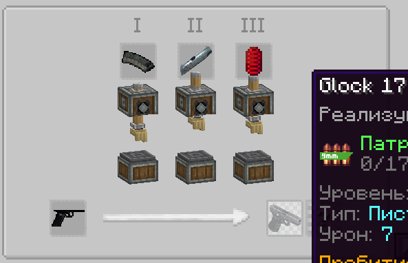

  <strong>CZ 75</strong>

Создается CZ 75 из корпуса CZ 75, железной рукоятки, магазина, затвора пистолета, возвратной пружины

  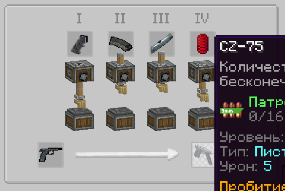

### Крафт револьвера

  <strong>Rhino Revolver</strong>

Создается Rhino Revolver из корпуса Rhino Revolver, деревянной рукоятки, ствола оружия, барабана револьвера, возвратной пружины.

  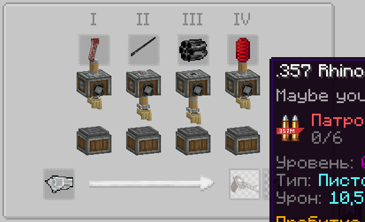

### Крафты винтовок

  <strong>AKM</strong>

Создается АКМ из корпуса АКМ, деревянного приклада, деревянной рукоятки, магазина, ствола оружия, возвратного механизма, затвора винтовки.

  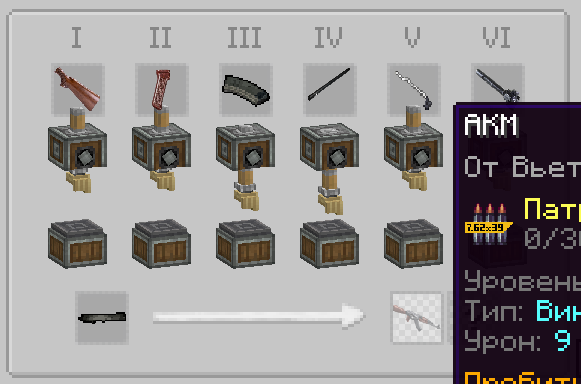

  <strong>M4A1</strong>

Создается M4A1 из корпуса M4A1, железного приклада, железной рукоятки, магазина, ствола оружия, возвратного механизма, затвора винтовки.

  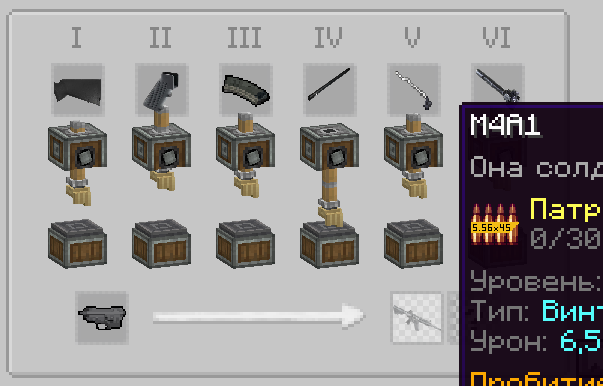

  <strong>HK G3</strong>

Создается HK G3 из корпуса HK G3, железного приклада, железной рукоятки, магазина, ствола оружия, возвратного механизма, затвора винтовки.

  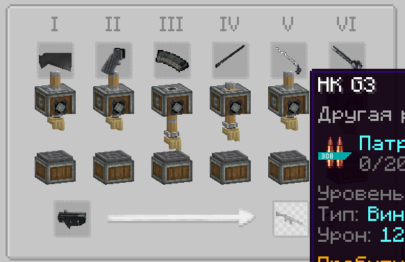

## Крафты составляющих оружия

  <strong>Деревянный приклад</strong>

  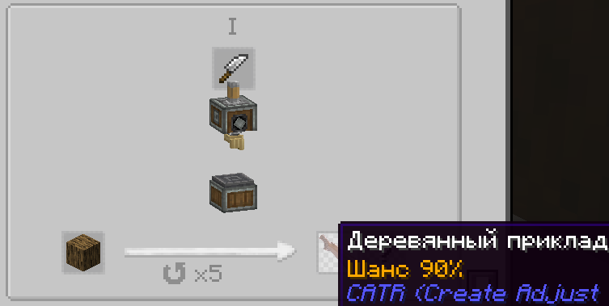

  <strong>Деревянная рукоятка</strong>

  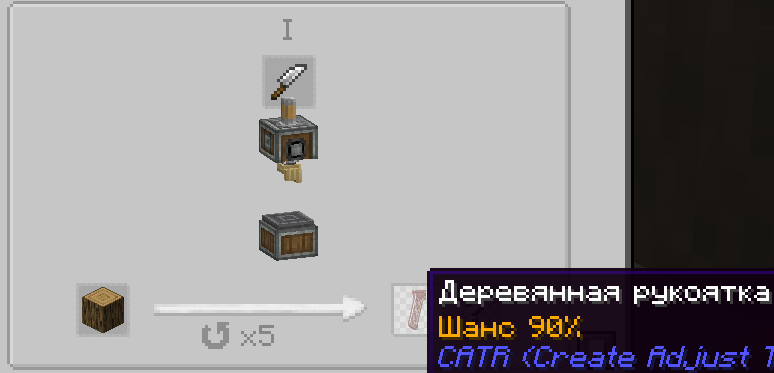

  <strong>Железный приклад</strong>

  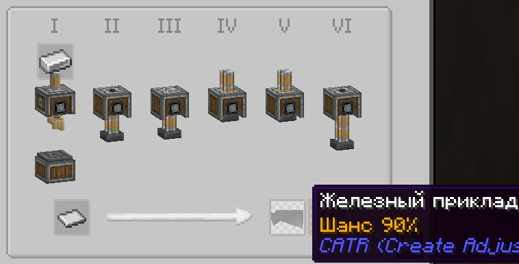

  <strong>Железная рукоятка</strong>

  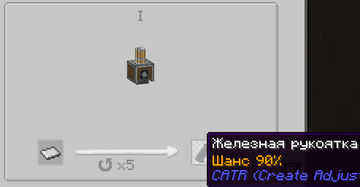

  <strong>Магазин оружия</strong>

  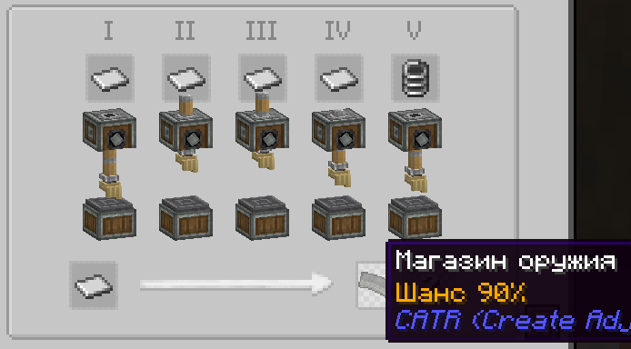

  <strong>Железное сверло</strong>

  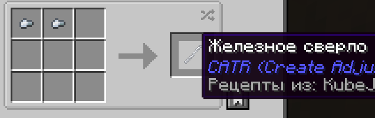

  <strong>Затвор пистолета</strong>

  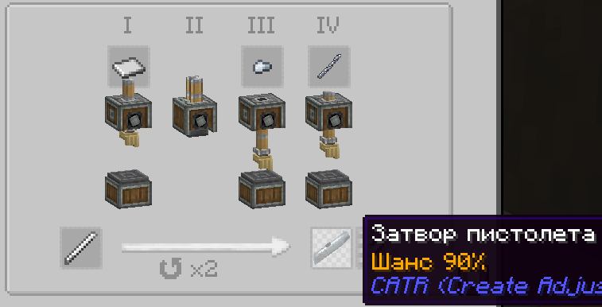

  <strong>Возвратная пружина</strong>

  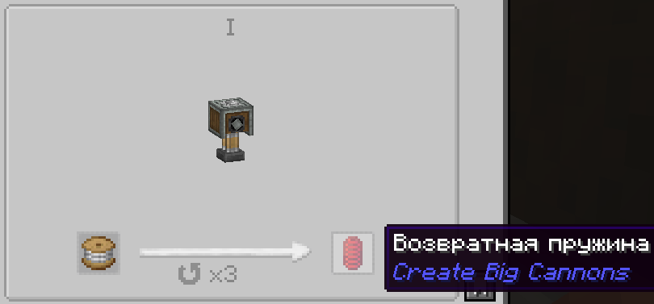

  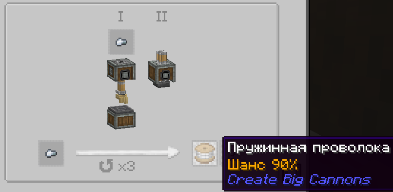

  <strong>Барабан револьвера</strong>

  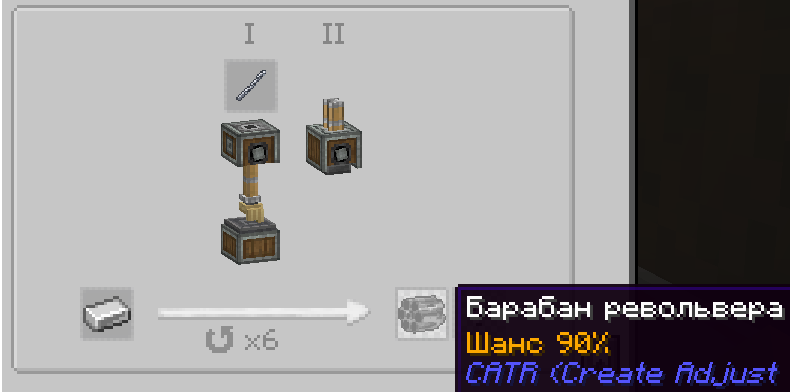

  <strong>Ствол оружия</strong>

  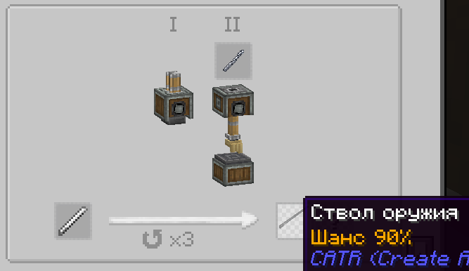

  <strong>Возвратный механизм</strong>

  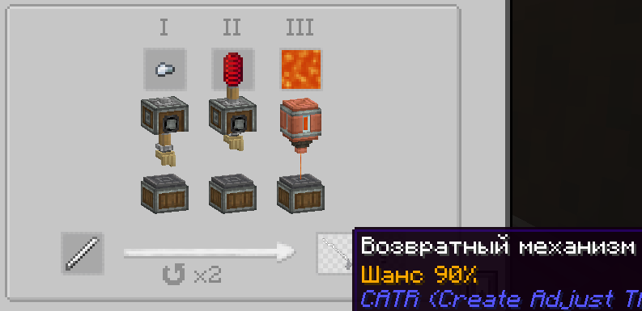

  <strong>Затвор винтовки</strong>

  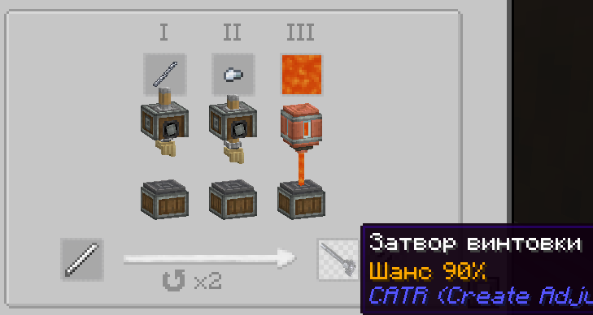

  <strong>Создание корпусов оружий из железной пластины с помощью камнереза</strong>

  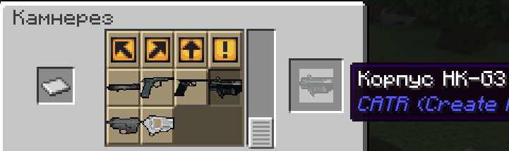

  <strong>Автоматизация создания деревяных рукояток и прикладов с помощью механической пилы</strong>

  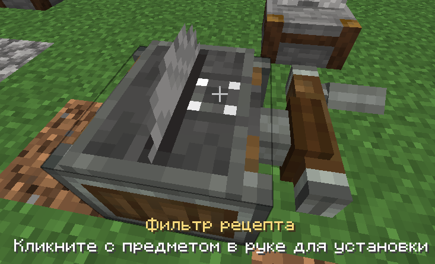

  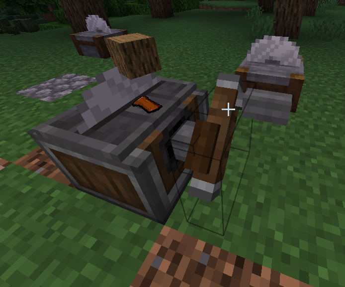

  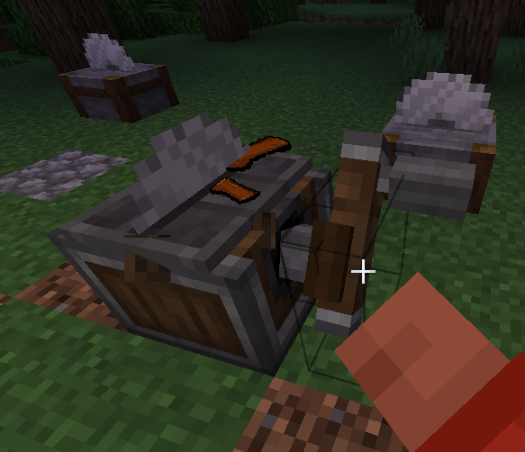

  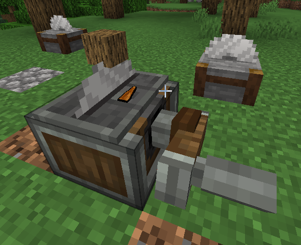

  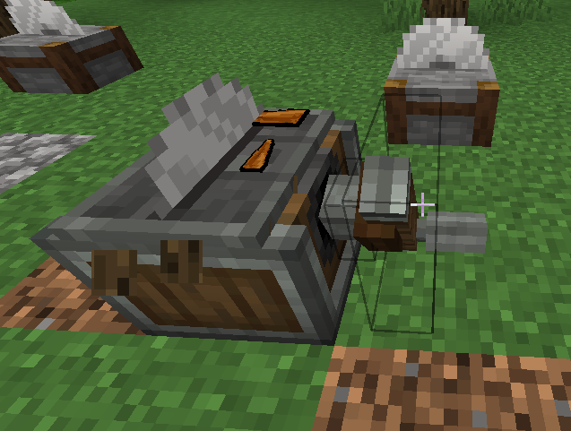

  <strong>Автоматизация создания корпусов с помощью механической пилы</strong>

  

  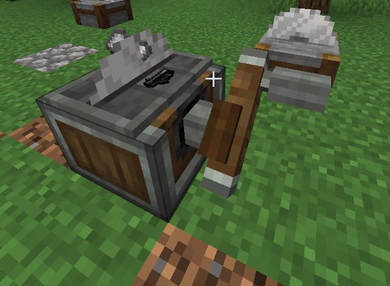

  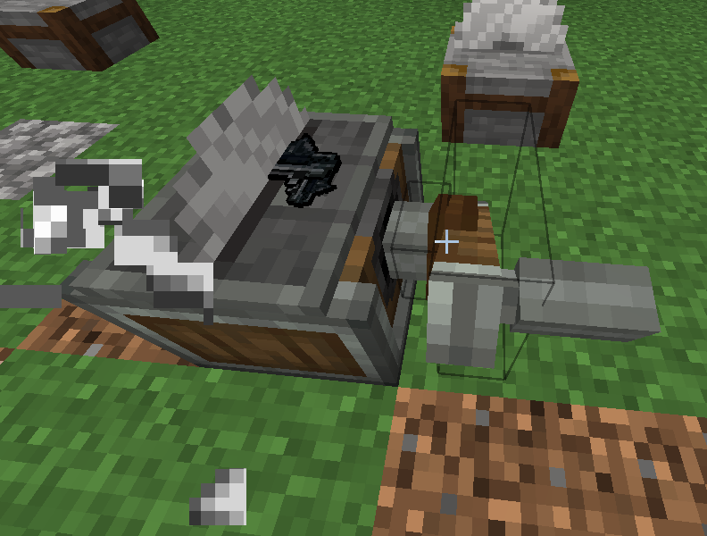

